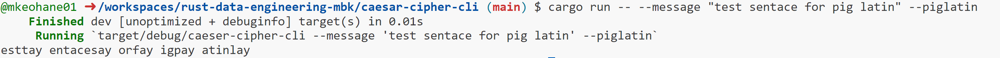

[](https://github.com/nogibjj/rust-data-engineering/actions/workflows/lint.yml)
[](https://github.com/nogibjj/rust-data-engineering/actions/workflows/tests.yml)


# Mini Project 7 - Rust CLI Packaging

## Modifying a Rust Command

Modified the caesar-cipher-cli to include an option to encode the message using piglatin.
   - piglatin rules found at https://web.ics.purdue.edu/~morelanj/RAO/prepare2.html

#### To use:
Navigate to the caesar-cipher-cli folder and run the command using the piglatin keyword.
1. ```cd caesar-cipher-cli```
2. ```cargo build```
3. ```cargo run -- --message <message text> --piglatin```

#### Example:



### Makefile

Each subdirectory project uses this style to make it easy to test and run

```
format:
	cargo fmt --quiet

lint:
	cargo clippy --quiet

test:
	cargo test --quiet

run:
	cargo run 

all: format lint test run
```


### References

Project forked from https://github.com/nogibjj/rust-data-engineering and fulfils IDS 706 MP7
